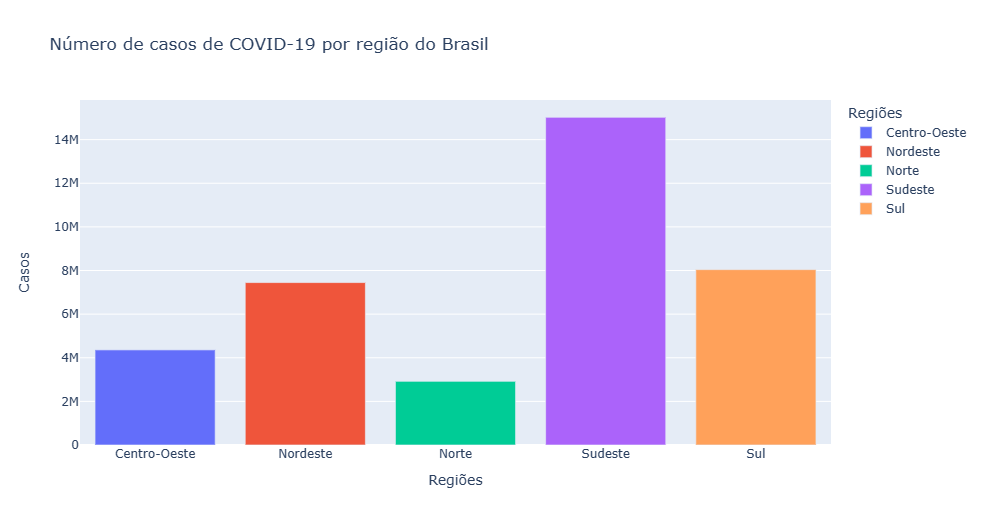
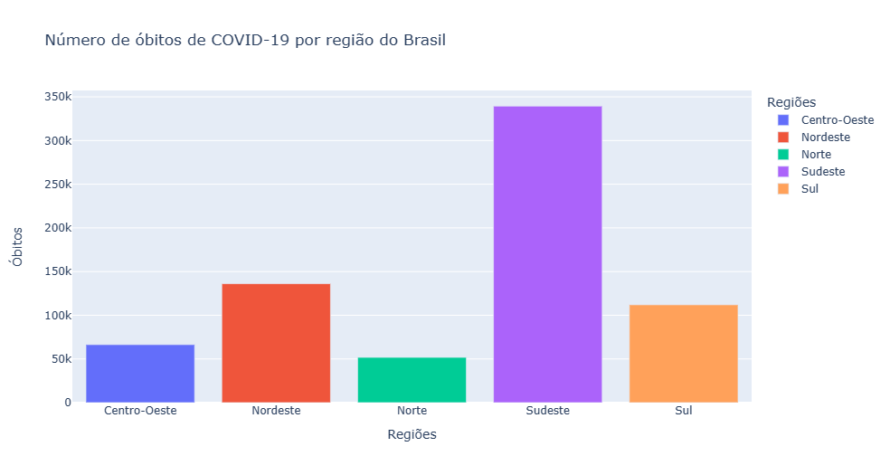
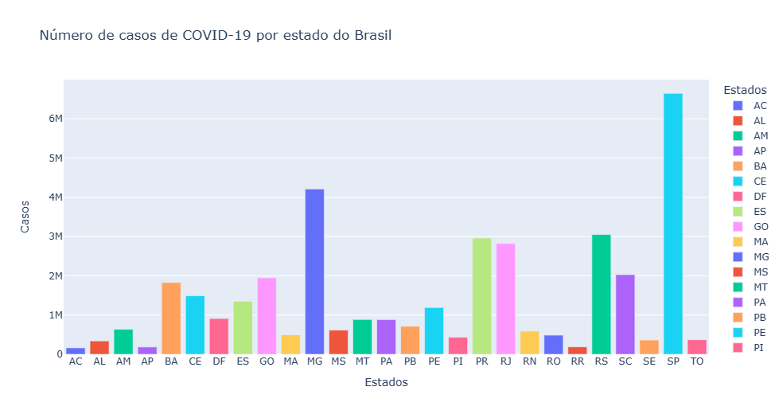
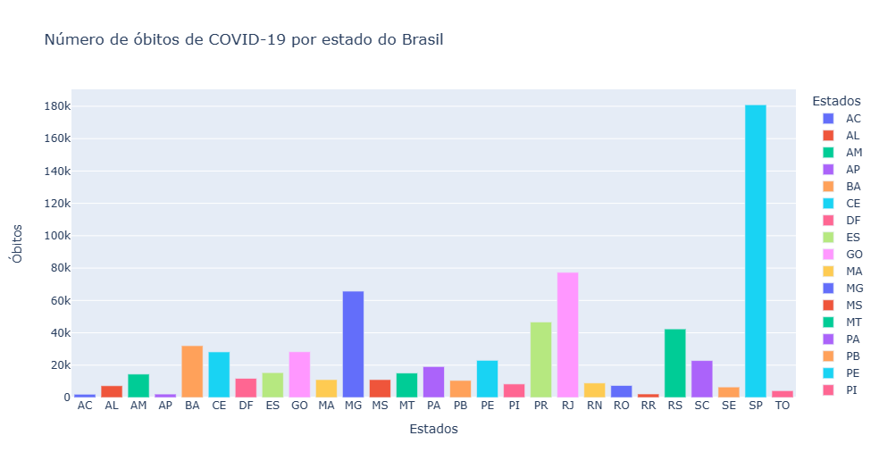

# Visualização de dados sobre o número de casos e óbitos de COVID-19 por estado e região do Brasil

Visualização de dados sobre o número de casos e óbitos de COVID-19 por estado e região do Brasil até o dia 04/08/2023, através de gráficos interativos com a biblioteca Plotly.

